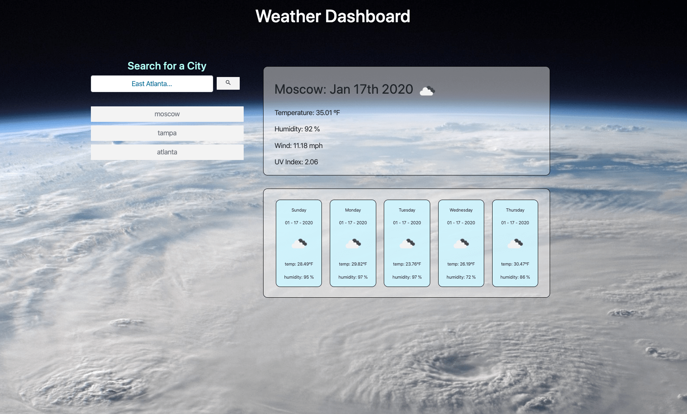

# 06-WeatherDashboard

It's a Weather App.

# Description

This work is a simple weather tracker and forecast app, build with the [open weather api](https://openweathermap.org/). Search for your city or, as the background image indicates, anywhere on earth! The top-right box houses the current weather in the location, and the bottom-right box will show a 5 day forecast for the given location.

Enjoy and remember,
Efficiency is the key to success!!!

;

# About

I built this with a very basic understanding of local storage, JSON, API's and JavaScript in general. I would like to come back and further build-out the app to offer "current location" services. The app will populate your current location's weather, once the request is approved.

# Usage

The "current weather" & "forecast" functions live inside one-another. I will get better at using call-backs and build this in a more efficient manor in the future. Constructive criticism is invited and welcome.

# Installation

Clone to your machine locally, or visit the live version at [Weather App](https://johnsasser.github.io/06-WorkScheduler/index.html)!

# Built With

- HTML5
- CSS3
- BOOTSTRAP 4
- JAVASCRIPT
- JQUERY
- JSON
- OPEN WEATHER API'S

# Contributing

Pull requests are welcome. For major changes, please open an issue first to discuss what you would like to change.

Please make sure to update tests as appropriate.

# Banter

    -   ALGORITHM OF SUCCESS
    while(noSuccess){
        tryAgain();
    if(dead)
    breakComputer();
    }
